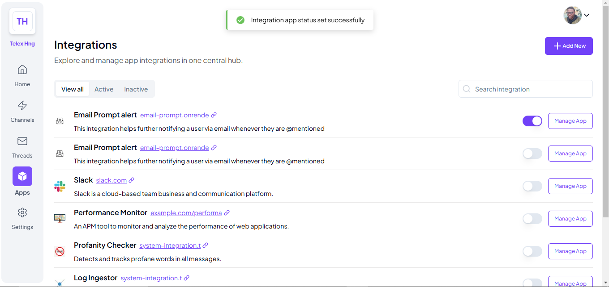
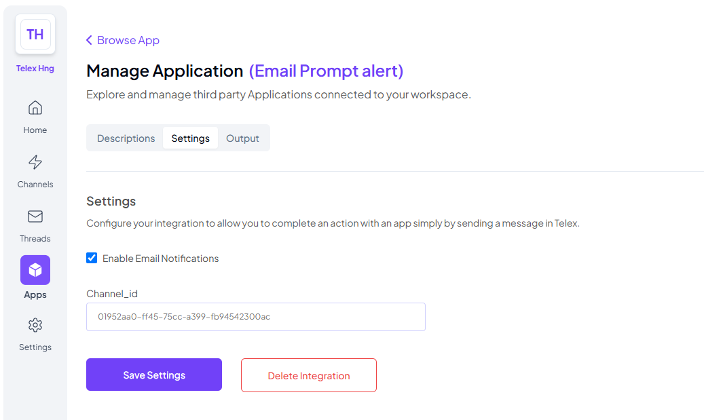

# 📧 Email Prompt API
This API automatically sends an email to any user @mentioned in the channel it is activated in.

It's hosted on https://email-prompt-alert.onrender.com/

# How to use
- Install the integration using its JSON URL at: https://email-prompt-alert.onrender.com/integration.json
- Toggle the integration service ON and click on the MANAGE APP button. Choose settings and fill in the required fields:
    > channel_id: Channel ID of channel you want to activate it in (Check webhook configurations)
- After this, any user @mentioned will get an email notification of the message from a template mail earforsound@gmail.com

